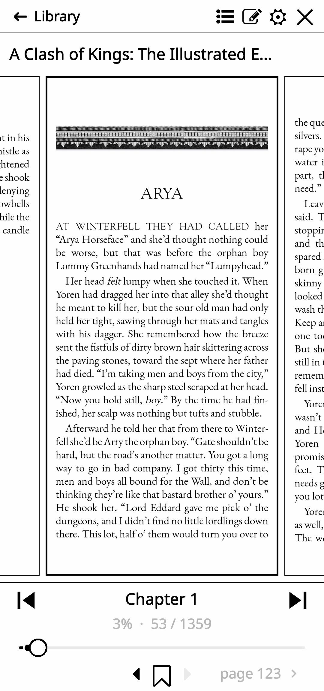
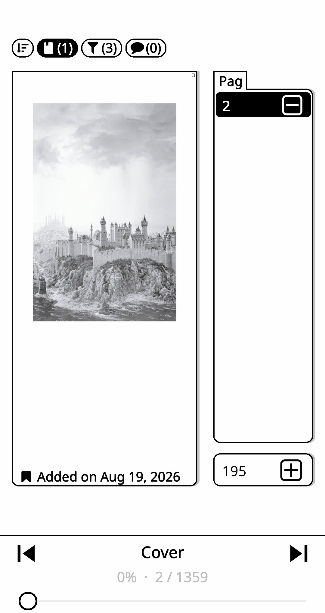
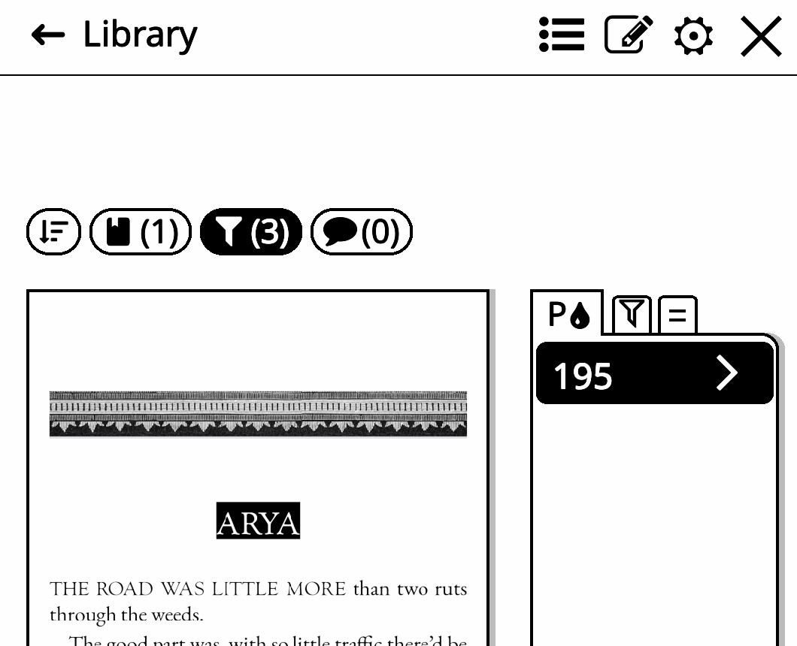
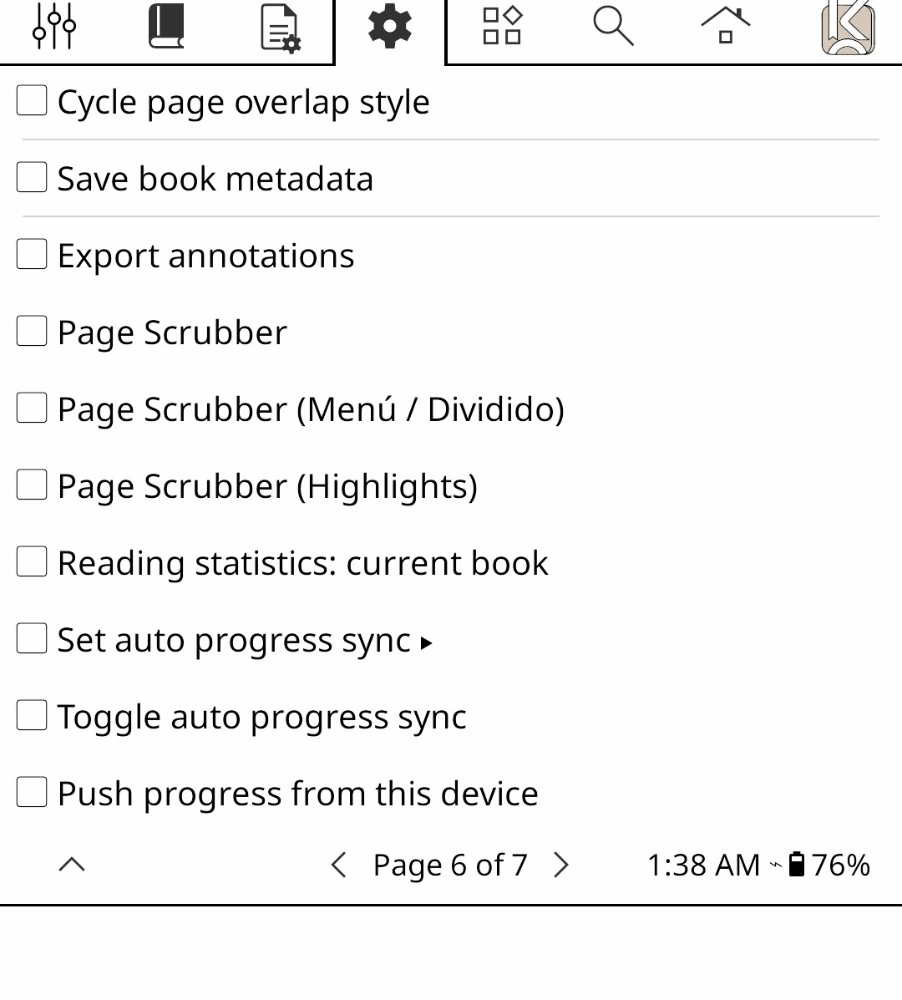

# KOReader Custom Patches 📚
Custom Lua patches for **KOReader** optimized for E-ink devices.

# 📖 Page Browser 
This patch allows you to quickly flip back and forth through the book, with the option to easily return to your original page using the 'x' button or stay on the new page. You can also use the interactive progress bar and bookmark browser. Streamlined, E-ink optimized, based on KOReader's browser architecture and inspired by the native Kindle page picker experience. Compatible with EPUB, CBZ, and PDFs!
   
**Get patch: [**2-page-browser.lua**](./2-page-browser.lua)**

**Features**:
* **3-Page Thumbnail Grid:** Displays a live preview of the previous, current, and next pages side by side, keeping the active page perfectly centered.
* **E-Ink Safe Navigation:** Features a slow, controlled hold-to-repeat page turning speed to prevent ghosting loops and screen lag.
* **Quick Access Toolbar:** Top navigation bar with direct buttons for Home, Settings, Bookmarks, Table of Contents, and Font Options. 
* **Progress & Info Bar:** Includes an interactive slider, chapter title, and a precise percentage/page counter. You can algo go to the next/previous chapter with the (>>/<<) buttons next to the chapter title.
* **Physical Button Support**: Compatible with devices with physical buttons (D-Pad).
* **Split-View Bookmarks Menu**: Split-screen bookmark, highlight and note manager. Features a dynamic, scrollable bookmark list on the right, a fully interactive high-res page preview on the left, and safely pins the origin page in a rounded bottom container.

> **🌟 NEW: UI Scaling**: Just long-press the Settings (Gear) icon to bring up the slider to resize the menu (e.g., `0.8` makes it 20% smaller).
> You MUST disabled any old or duplicate `.lua` scrubber/browser files from your KOReader folder before installing this. 

@ *Credits & Acknowledgments* 
* inspired by **Zen UI Plugin:** (`anthonygress/zen_ui.koplugin`).
* Built upon KOReader's core architecture and community browser components.

# 📄 Page Scrubbers (Unmaintained)
* [**2-page-scrubber.lua**](./2-page-scrubber.lua): Centered floating window with rounded corners, and quick-access buttons.
 * [**2-page-scrubber-alt.lua**](./2-page-scrubber-alt.lua): Bottom bar with progress, chapter info, and a top navigation toolbar. It's the simplest and more subtle page scrubber of the bunch. 
 
   
## 📱 Screenshots: 
| Vista Principal | Modo Dividido |
| :---: | :---: |
|  |  |
| **Pestañas / Menú** | **Detalle de escala (Compacto)** |
|  |  |

## ⚙️ Installation
 1. Download the .lua file.
 2. Place it in your KOReader user plugins/patches folder.
 3. Restart KOReader.
   
    
  **Setup & Activation**
 1. Open a book in KOReader.
 2. Go to **Settings** (⚙️) > **Gestures** > **Reader**.
 3. Choose your preferred gesture and assign it to **Page Scrubber**
> You can only lunch one patch of this collection at a time, if you try to activate more than one it won't work.
